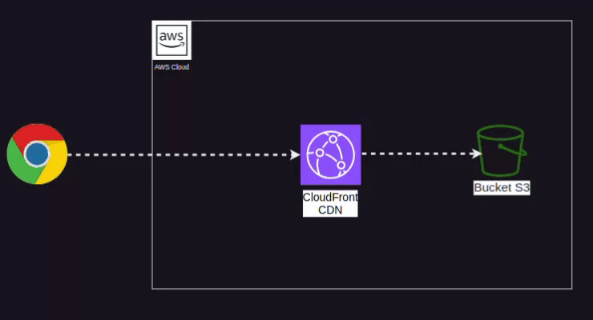

# Hospedando um Site Estático em um Bucket S3 com CloudFront Usando Terraform

## Visão Geral
Este guia mostra como configurar a infraestrutura para hospedar um site estático em um bucket S3 e distribuir seu conteúdo globalmente com o CloudFront. A configuração é realizada utilizando Terraform, uma ferramenta IaC (Infrastructure as Code).

## Arquitetura do projeto

<p align="center">
  
</p>


### Recursos que serão criados
1. Bucket S3 para armazenar os arquivos do site estático.
2. Configuração de política de bucket para permitir acesso público ao conteúdo do site.
3. Distribuição CloudFront para entregar o site de forma otimizada globalmente.
4. Configuração de um certificado SSL usando o AWS Certificate Manager (opcional).
5. Configuração do Terraform para gerenciar a infraestrutura.

---

## Pré-requisitos
- Conta na AWS.
- Instalação do Terraform na sua máquina.
- Permissões necessárias para criar recursos no AWS S3, CloudFront e ACM.

---

## Passos

### 1. Configurar o Bucket S3

# Configuração de Bucket S3 para Hospedagem de Site Estático com Terraform

Este código configura um bucket S3 na AWS, utilizando Terraform, para hospedar um site estático. Ele inclui a criação do bucket, um arquivo de exemplo (`index.html`), e a aplicação de uma política de acesso público ao bucket.

## Código Terraform

```hcl
# Definindo o provedor AWS
provider "aws" {
  region = "us-east-1"  # Define a região onde o bucket será criado
}

# Criação do bucket S3
resource "aws_s3_bucket" "example" {
  bucket = "xxxxxxxxxxxx"  # Nome único do bucket (deve ser único globalmente)
  acl    = "public-read"         # Permite leitura pública para hospedar um site estático

  # Configuração para hospedar site estático
  website {
    index_document = "index.html"  # Documento principal do site
    error_document = "error.html"  # Documento exibido em caso de erro
  }

  # Tags para identificar o bucket
  tags = {
    Name        = "MeuBucketEstático"  # Nome amigável
    Environment = "Produção"           # Ambiente associado ao bucket
  }
}

# Upload de um arquivo index.html para o bucket
resource "aws_s3_bucket_object" "example_object" {
  bucket       = aws_s3_bucket.example.bucket  # Bucket onde o objeto será armazenado
  key          = "index.html"                  # Nome do arquivo no bucket
  source       = "~/Documents/Ec2 estudo/index.html" # Caminho local do arquivo a ser carregado
  content_type = "text/html"                   # Tipo de conteúdo do arquivo (HTML)
}

# Adicionando uma política ao bucket para permitir acesso público
resource "aws_s3_bucket_policy" "example_policy" {
  bucket = aws_s3_bucket.example.id  # Referência ao bucket criado

  policy = jsonencode({
    Version = "2012-10-17"  # Versão da política
    Statement = [
      {
        Sid       = "PublicReadGetObject"  # Identificador da regra
        Effect    = "Allow"               # Permissão concedida (Allow)
        Principal = "*"                   # Permissão para todos os usuários
        Action    = "s3:GetObject"        # Ação permitida (leitura de objetos)
        Resource  = "arn:aws:s3:::xxxxxxxxxx/*"  # nome do bucket (aplica-se a todos os objetos do bucket)
      }
    ]
  })
}
