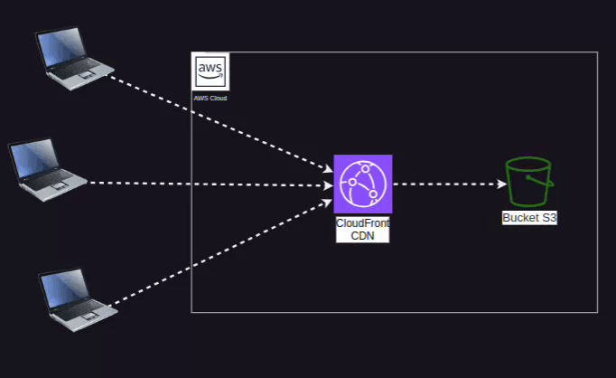

# Hospedando um Site Estático em um Bucket S3 com CloudFront Usando Terraform

## Visão Geral
Este projeto mostra como configurar a infraestrutura para hospedar um site estático em um bucket S3 e distribuir seu conteúdo globalmente com o CloudFront. Utilizei o Terraform para a construção de toda a infraestrutura.
## Arquitetura do projeto

<p align="center">
  
</p>


### Recursos que serão criados
1. Bucket S3 para armazenar os arquivos do site estático.
2. Configuração de política de bucket para permitir acesso público ao conteúdo do site.
3. Distribuição CloudFront para entregar o site de forma otimizada globalmente.
4. Configuração de um certificado SSL usando o AWS Certificate Manager (opcional).
5. Configuração do Terraform para gerenciar a infraestrutura.

---

### 1. Configurar o Bucket S3

# Configuração de Bucket S3 para Hospedagem de Site Estático com Terraform

Este código configura um bucket S3 na AWS, utilizando Terraform, para hospedar um site estático. Ele inclui a criação do bucket, um arquivo de exemplo (`index.html`), e a aplicação de uma política de acesso público ao bucket.

## Código Terraform

```hcl
# Definindo o provedor AWS
provider "aws" {
  region = "us-east-1"  # Define a região onde o bucket será criado
}

# Criação do bucket S3
resource "aws_s3_bucket" "example" {
  bucket = "xxxxxxxxxxxx"  # Nome único do bucket (deve ser único globalmente)
  acl    = "public-read"   # Permite leitura pública para hospedar um site estático

  # Configuração para hospedar site estático
  website {
    index_document = "index.html"  # Documento principal do site
    error_document = "error.html"  # Documento exibido em caso de erro
  }

  # Tags para identificar o bucket
  tags = {
    Name        = "MeuBucketEstático"  # Nome amigável
    Environment = "Produção"           # Ambiente associado ao bucket
  }
}

# Upload de um arquivo index.html para o bucket
resource "aws_s3_bucket_object" "example_object" {
  bucket       = aws_s3_bucket.example.bucket        # Bucket onde o objeto será armazenado
  key          = "index.html"                        # Nome do arquivo no bucket
  source       = "~/Documents/Ec2 estudo/index.html" # Caminho local do arquivo a ser carregado
  content_type = "text/html"                         # Tipo de conteúdo do arquivo (HTML)
}

# Adicionando uma política ao bucket para permitir acesso público
resource "aws_s3_bucket_policy" "example_policy" {
  bucket = aws_s3_bucket.example.id  # Referência ao bucket criado

  policy = jsonencode({
    Version = "2012-10-17"  # Versão da política
    Statement = [
      {
        Sid       = "PublicReadGetObject"        # Identificador da regra
        Effect    = "Allow"                      # Permissão concedida (Allow)
        Principal = "*"                          # Permissão para todos os usuários
        Action    = "s3:GetObject"               # Ação permitida (leitura de objetos)
        Resource  = "arn:aws:s3:::xxxxxxxxxx/*"  # nome do bucket (aplica-se a todos os objetos do bucket)
      }
    ]
  })
}

```


# Criando a distribuição do CloudFront

```hcl
resource "aws_cloudfront_distribution" "example" {
  origin {
    domain_name = aws_s3_bucket.example.bucket_regional_domain_name # Endereço do bucket S3
    origin_id   = "S3-hospedagem-site-s3"

    # Configuração para integrar o CloudFront com o bucket S3
    s3_origin_config {
      origin_access_identity = aws_cloudfront_origin_access_identity.example.cloudfront_access_identity_path
    }
  }

  enabled             = true               # Habilita a distribuição
  default_root_object = "index.html"       # Documento padrão da distribuição

  # Configuração de comportamento padrão
  default_cache_behavior {
    allowed_methods  = ["GET", "HEAD"]     # Métodos HTTP permitidos
    cached_methods   = ["GET", "HEAD"]     # Métodos que podem ser armazenados em cache
    target_origin_id = "xxxxxxxxxxxxxxx"

    viewer_protocol_policy = "redirect-to-https" # Redireciona solicitações HTTP para HTTPS

    forwarded_values {
      query_string = false               # Não encaminha parâmetros de consulta
      cookies {
        forward = "none"                 # Não encaminha cookies
      }
    }

    min_ttl     = 0                      # Tempo de vida mínimo do cache
    default_ttl = 3600                   # Tempo de vida padrão (1 hora)
    max_ttl     = 86400                  # Tempo de vida máximo (1 dia)
  }

  # Configuração de HTTPS
  viewer_certificate {
    cloudfront_default_certificate = true # Usa o certificado padrão do CloudFront
  }

  # Tags para organização
  tags = {
    Environment = "Production"
    Project     = "StaticWebsite"
  }
}

# Criando uma identidade de acesso para o CloudFront acessar o bucket S3
resource "aws_cloudfront_origin_access_identity" "example" {
  comment = "Acesso do CloudFront ao bucket hospedagem-site-s3"
}
```
<br><br>

# Resumo de todo projeto

O processo de hospedar um site estático no **Amazon S3** combinado com a **CloudFront** fornece uma solução robusta e escalável para disponibilizar conteúdo na web. Aqui está um resumo dos resultados dessa hospedagem:

## O que foi feito:
- **Bucket S3**: Criei um bucket no Amazon S3 com a configuração de **hospedagem de site estático**. O bucket contém os arquivos essenciais, como `index.html` (página inicial) e `error.html` (página de erro).
  
- **Política de Acesso**: Configurei uma política de bucket permitindo acesso público aos objetos, tornando o site acessível por qualquer usuário com o link público.

- **CloudFront**: Utilizamos o **Amazon CloudFront**, a rede de distribuição de conteúdo (CDN) da AWS, para distribuir o conteúdo do bucket S3 globalmente com alta performance e baixa latência. CloudFront ajuda a acelerar a entrega de conteúdo, melhorando a experiência do usuário.

- **HTTPS**: A configuração de HTTPS foi ativada para garantir que as conexões sejam seguras. Utilizamos o **certificado SSL padrão do CloudFront**.

- **Redirecionamento para HTTPS**: Configuração do CloudFront para redirecionar todas as solicitações HTTP para HTTPS, garantindo maior segurança para os usuários.

## Resultados:
- O site agora está hospedado de forma **segura e eficiente**, com conteúdo entregue rapidamente aos usuários em qualquer parte do mundo.
- O uso do **CloudFront** oferece cache de conteúdo, o que reduz a carga no servidor de origem (bucket S3), acelerando o tempo de resposta para os usuários.
- O **CloudFront** também garante alta disponibilidade e resiliência, com múltiplas localizações de borda espalhadas globalmente.
  
## Benefícios:
- **Escalabilidade**: A AWS automaticamente escala para atender grandes volumes de tráfego sem necessidade de configuração adicional.
- **Custo-benefício**: Apenas paga-se pelo armazenamento do S3 e pela largura de banda do CloudFront, sem necessidade de servidores ou manutenção de infraestrutura.
- **Segurança**: A comunicação HTTPS garante que os dados dos usuários sejam criptografados, e o acesso ao bucket S3 é controlado por meio de políticas de acesso específicas.

## Conclusão:
A hospedagem de sites estáticos no **Amazon S3** com **CloudFront** é uma solução altamente eficiente, segura e escalável, perfeita para sites que exigem alta disponibilidade e rápido tempo de carregamento, com a vantagem adicional de custo otimizado.

## Clique no link abaixo e veja o resultado!
=====>>>> 
[Visite o site](https://hospedagem-site-s3.s3.us-east-1.amazonaws.com/index.html)
<<<======


